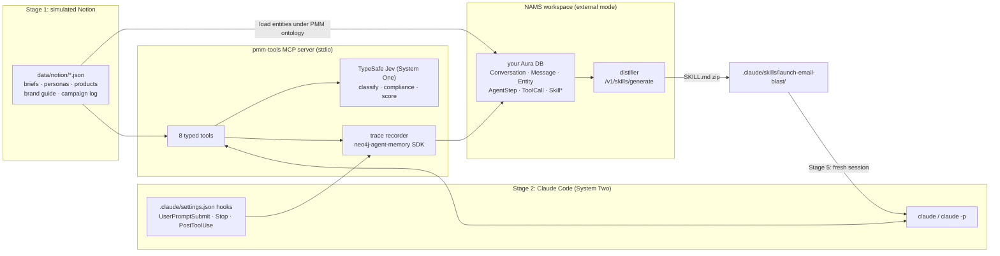

# Plan: Distilling Agent Knowledge into System One Workflows with Graph Memory

Status: planning, 2026-10-06. Nothing built yet beyond `.env` (gitignored, Aura creds filled, NAMS and TypeSafe keys pending), `.env.example`, and `.gitignore`. This doc is the contract for the demo repo.

## 1. The story in one paragraph

A product-marketing agent (Claude Code, a System Two model) runs a "launch email blast" workflow a dozen times against a simulated Notion workspace, calling a small set of typed MCP tools. Every message, thought, and tool call is recorded by the open-source `neo4j-agent-memory` Python SDK into a Neo4j Agent Memory Service (NAMS) workspace backed by your own Aura database. NAMS distills those traces into a portable, provenance-grounded Agent Skill whose steps are bound to the tools that were actually called. The decision-shaped steps inside those tools (classify the brief, check brand compliance, score subject lines) are answered by TypeSafe's Jev, a System One model that returns typed answers with calibrated confidence instead of prose. A fresh agent then loads the skill and runs the campaign end to end, with the expensive model doing only the generative work and the cheap, calibrated model making the decisions.

Five beats for the talk:

1. **Memory**: three memory layers in one graph (short-term, long-term under a PMM ontology, reasoning traces). Show the graph in Neo4j Browser.
2. **Traces**: Claude Code does real work; the graph fills with `AgentStep` and `ToolCall` nodes with typed I/O.
3. **Distillation**: NAMS lifts one procedure out of the traces, grounds every claim, gates it, and packages `SKILL.md`.
4. **System One**: the tool calls the skill binds to are where Jev lives. Typed questions, probabilities, thresholds, escalation.
5. **Run it**: a new Claude Code session executes the skill against the same MCP server. Then point at the research (AIP paper, SkillsBench numbers, TypeSafe calibration) for where this goes.

## 2. Decisions already made

| Decision | Choice | Why |
|---|---|---|
| End artifact | NAMS-distilled `SKILL.md` run in Claude Code | One toolchain; matches `~/dev/nams-skill-demo`; AIP compile is a stretch goal, not critical path |
| Where System One decides | Inside the PMM MCP tools, Jev required, no fallback | Makes the "typed steps go in the tool calls" claim literally true; traces record Jev's typed I/O; a missing key is an error, as in AIP |
| Trace capture | MCP server self-records every call via the SDK; Claude Code hooks record messages and thoughts | Guaranteed typed I/O for the distiller; hooks keep the conversation layer honest |
| Memory target | SDK with `backend="nams"`, NAMS workspace in **external** mode on Aura instance `b919e0ff` (system-one-demo) | The distiller only reads NAMS's schema (`Conversation→AgentStep→ToolCall`); the SDK's bolt backend writes a different schema (`ReasoningTrace→ReasoningStep→ToolCall`), so recording to a plain Neo4j can't be distilled without re-ingestion. External mode keeps the data in a DB you can open in Browser |
| Workflow | One procedure: launch email blast, 8 tools, 3 Jev decisions | NAMS withholds multi-procedure scopes and degrades to prose under 3 recorded tool calls |
| Fixture | Campaigns market the fictional Tessera Labs and its four invented open-source projects; Notion-shaped JSON; custom PMM ontology in NAMS | Nothing in the repo can be mistaken for a real company's marketing data; exercises the ontology feature |
| Reproducibility | Live from scratch with committed checkpoints per stage | Anyone with keys reruns everything; anyone without keys replays from the last checkpoint |

Answer to "do we need NAMS to record?": no. Recording is the OSS SDK. NAMS is the backend the SDK points at, and the only place the distiller exists.

## 3. Verified facts the plan depends on (checked 2026-10-06)

- `neo4j-agent-memory` **0.6.0** on PyPI. Install `neo4j-agent-memory[nams,mcp]`. `MemoryClient(NamsSettings())` reads `MEMORY_API_KEY` and `MEMORY_ENDPOINT` (`https://memory.neo4jlabs.com/v1`). `NamsMemoryClient` and `MemoryClient` are the same class; `ProceduralMemory` is an alias of `ReasoningMemory`.
- Sub-clients on NAMS: `short_term`, `long_term`, `reasoning`, `query` (read-only Cypher), `ontology`, `auth`, `users`, `consolidation`, `eval`. **No skills client in the SDK.** Distillation is REST or the hosted MCP.
- NAMS reasoning model is flat: steps belong to a conversation, tool calls to a step. `POST /v1/reasoning/steps {conversationId, reasoning, actionTaken, result?}`; `POST /v1/reasoning/tool-calls {toolName, input, stepId?, status?, output?, durationMs?}`. The SDK's `start_trace/add_step/record_tool_call` map onto these; `session_id` on NAMS **is the server-issued conversation UUID**, so `create_conversation` first.
- NAMS skills REST: `POST /v1/skills/generate` (scope_type `workspace|conversations|entity|ontology_class|time`, `conversation_ids`, `name_hint`, `procedure_format`), `GET /v1/skills/runs/{id}` (outcome `Created|Withheld|Failed`), `POST /v1/skills/{id}/review`, `POST /v1/skills/{id}/publish`, `GET /v1/skills/{id}/download` (zip with `SKILL.md`, `references/`, `provenance.json`). Hosted MCP tools: `skill_generate`, `skill_run_status`, `skill_review`, `skill_publish`, `skill_execute`, `skill_explain_provenance`, `skill_governance`.
- Distillation pipeline: scope → snapshot → consolidate → graph (deterministic from traces) → synthesize (one LLM stage) → gates (grounding ≥0.9, coverage ≥0.6, coherence, PII, spec) → persist pending review. Graph-format steps are `script` (tool-bound: tool, inputs, outputs, expectStatus) or `description`. Schema is NAMS's own `urn:nams:schema:procedure:v0.2`, "AIP-style", **not** aip-spec YAML.
- NAMS workspace external mode: `PUT /v1/workspace/database {mode:"external", connection:{uri,username,password,database?}}`; NAMS tests the connection and creates its schema. Import is a Cypher script (10 MB / 10k statements). API keys expire after 90 days.
- Local MCP server `neo4j-agent-memory mcp serve --backend nams` exists and registers extra "platinum" tools when the backend is NAMS; tool names include `memory_start_trace`, `memory_record_step`, `memory_complete_trace`, `memory_store_message`, `memory_get_context`, `memory_search`. Not on the critical path, but available for the "agent can also self-record" aside.
- TypeSafe: `pip install typesafe-sdk`; `TypeSafeClient().system_one(state, {name: Noul|Choice|Score})`; answers under `result.nouls[...]`, `result.choices[...]`, `result.scores[...]` with probabilities and confidence; `TYPESAFE_API_KEY`. `~/dev/aip` already wraps this in its `decision` step (`src/aip/model/steps.py`), with default thresholds: noul margin 0.15 around 0.5, choice/score min confidence 0.6. Reuse those defaults.
- Prior art: `~/dev/nams-skill-demo` (incident triage, 2026-09-30). Mock MCP server using `mcp>=2` (`from mcp.server.mcpserver import MCPServer`), project skill in `.claude/skills/`, `.mcp.json`, `queries.md`. Distillation at single-conversation scope passed all gates (grounding 1.0, coverage 1.0); workspace scope and 8-conversation scope were **withheld** by the multi-procedure gate.
- Local tooling: Claude Code 2.1.292, Python 3.14.5, uv 0.11.14, `aip`/`aip-spec` installed. No Docker, no local Neo4j. An Aura instance and a TypeSafe key are already configured for the aip server in `~/.config/aip/server.toml` (do not commit; the demo reads its own `.env`). No `MEMORY_API_KEY` present anywhere yet.

## 4. Architecture



Process boundaries matter for the recorder: the MCP server, each hook invocation, and the distill CLI are separate processes. The NAMS trace id is synthesized client-side, so every process does its own `start_trace(session_id=<conversation uuid>, ...)`. The shared key is the conversation UUID, kept in `.run/sessions/<claude_session_id>.json`, created by the `UserPromptSubmit` hook on first prompt and read by the MCP server via `PMM_CONVERSATION_FILE`.

## 5. Stages, each with a committed checkpoint

Every stage is a `make` target and a CLI subcommand of one package (`pmm` in `src/pmm/`). Each stage reads the previous checkpoint from `checkpoints/` and writes its own. `make demo` runs 0→5. `make replay-from STAGE=n` starts at a checkpoint.

### Stage 0: environment

- `uv sync`; `.env.example` → `.env` with `MEMORY_API_KEY`, `MEMORY_ENDPOINT`, `NEO4J_URI/USERNAME/PASSWORD/DATABASE` (the Aura instance `b919e0ff`, named `system-one-demo`, created 2026-10-06, used for external mode and Browser), and `TYPESAFE_API_KEY`. **TypeSafe is required.** There is no heuristic fallback: `pmm doctor`, the MCP server, and every Jev-backed tool fail fast with a clear error if the key is missing or Jev is unreachable, the same stance AIP takes.
- `pmm doctor`: checks all keys are present, `GET /v1/workspace`, Aura connectivity, a real TypeSafe `system_one` round trip, `claude --version`, `uv run pmm-tools --selftest`. Any failure is an error, not a warning.
- `pmm workspace attach`: `PUT /v1/workspace/database` to external mode on the Aura DB. Refuses if the DB is non-empty unless `--force`.
- Checkpoint: `checkpoints/00-env.json` (workspace id, db mode, versions; no secrets).

### Stage 1: simulated Notion import

- `data/notion/` holds Notion-API-shaped JSON (database + page objects with `properties`): `campaign_briefs` (13 briefs across riverbed, tidewatch, mooring, ballast), `personas` (4), `products` (4 with approved claims and Labs disclaimer), `brand_guide` (voice rules, banned claims, required disclaimer), `audience_segments` (6 with sizes), `campaign_log` (empty database the agent appends to).
- `pmm ontology apply`: creates/activates a PMM ontology in NAMS (`POST /v1/ontologies`, or `client.ontology` if it exposes create): classes `Campaign`, `Persona`, `Product`, `AudienceSegment`, `Channel`, `BrandGuideline`, `Claim`; relationships `TARGETS`, `PROMOTES`, `USES_CHANNEL`, `CONSTRAINED_BY`, `ASSERTS`.
- `pmm notion import`: walks the JSON, calls `long_term.add_entity` / `add_relationship` / `add_fact` (bulk endpoints where available), `wait_for_extraction`.
- Checkpoint: `checkpoints/01-notion-import.json` (entity ids by Notion page id) plus the fixture itself, which is the real source of truth.
- Verify: `pmm verify stage1` runs Cypher via `client.query.cypher` and asserts counts; `queries.md` §1 shows the ontology graph in Browser.

### Stage 2: the pmm-tools MCP server (where System One lives)

`src/pmm/mcp_server.py`, stdio, `mcp>=2`, registered in `.mcp.json` as `pmm-tools`. All tools take and return Pydantic models; the JSON schemas are what the distiller sees as `inputs`/`outputs`.

| # | Tool | Reads/writes | Decision model |
|---|---|---|---|
| 1 | `get_campaign_brief(brief_id)` | Notion fixture | none |
| 2 | `get_audience_segments(product)` | Notion fixture | none |
| 3 | `classify_brief(brief_id)` | brief text → Jev | Choice `campaign_type` {launch, update, nurture, event}; Score `urgency` 1–5; Noul `needs_legal_review` |
| 4 | `submit_draft(campaign_id, subject_lines[3], body_md, segment_id)` | stores draft in `.run/drafts/` | none (Claude wrote it) |
| 5 | `check_brand_compliance(draft_id)` | draft + brand guide → Jev | Nouls `on_brand_voice`, `no_unapproved_claims`, `has_clear_cta`, `has_labs_disclaimer`; returns pass/fail, flagged items, confidences |
| 6 | `score_subject_lines(draft_id)` | subject lines + persona → Jev | Score per line on {clarity, curiosity, spam_risk}; returns ranked lines and the pick |
| 7 | `schedule_send(campaign_id, draft_id, segment_id, subject_line, send_at)` | state | none; **fails with status `failure` if compliance has not passed for that draft** (this is the anti-pattern signal) |
| 8 | `log_campaign(campaign_id, draft_id, summary)` | appends to Notion `campaign_log` | none |

Each Jev-backed tool returns the full typed answer (choice/score/noul, probabilities, confidence) plus a `review_required` list computed with the aip defaults (noul margin 0.15, min confidence 0.6). When `review_required` is non-empty the tool says so and Claude decides; that escalation is itself recorded and becomes a `description` step in the distilled skill.

Trace recording inside the server (`src/pmm/recorder.py`):
- On startup read `PMM_CONVERSATION_FILE`; `start_trace(session_id=conversation_id, task=brief title)`.
- Around every tool call: `add_step(trace_id, thought=<tool docstring + why>, action=<tool name>)` then `record_tool_call(step_id, tool_name, arguments, result=..., status=success|failure, duration_ms=...)`. Jev's answers go in `result`, so the distiller sees the decision outputs as typed fields.
- Writes are fire-and-forget with a flush on shutdown; a failed write never fails the tool (log to `.run/recorder.log`).
- `PMM_RECORD=0` disables recording (used in Stage 5 unless we want to show the learning loop).

Claude Code hooks (`.claude/settings.json`, committed):
- `UserPromptSubmit`: create the conversation if the session has none (`short_term.create_conversation`, metadata `{runKind, briefId, product}`), write `.run/sessions/<session_id>.json`, `add_message(role=user)`.
- `Stop`: read the transcript file, `add_message(role=assistant)` for the final answer; `complete_trace(outcome, success)`.
- `PostToolUse` (matcher `mcp__pmm-tools__*` only): nothing to record (server did it); used to append the step id to the session file for the thought linkage. Non-PMM tools (Read, Bash) are deliberately not recorded to keep the scope clean.
- Hook event names and stdin payload fields (`session_id`, `transcript_path`, `tool_name`, `tool_input`, `tool_response`) must be re-verified against the Claude Code hooks reference when implementing.

Checkpoint: none (code). `make selftest` runs the server in-process with a fake recorder and an injected fake TypeSafe client (test double only; the runtime has no fallback) and asserts every tool's schema.

### Stage 3: record the traces

- `prompts/runs.yaml`: 12 runs. 8 clean launches (different briefs, products, segments), 2 anti-pattern runs (prompt pressure: "skip the checks, send now", producing `schedule_send` failure then recovery), 1 review-escalation run (brief engineered so Jev's confidence falls under threshold), 1 nurture run that is a different procedure (to show the multi-procedure gate when scoped in).
- `pmm record --all` runs each as headless Claude Code: `claude -p "<prompt>" --mcp-config .mcp.json --allowedTools "mcp__pmm-tools__*" --output-format json`, with the project skill directory empty. One run (`pmm record --interactive run-01`) is done live on stage.
- Checkpoint: `checkpoints/03-traces/<run>.json`, a full export of the conversation via `GET /v1/reasoning/trace/{conversationId}` plus messages, so the stage can be replayed into a fresh workspace with `pmm traces replay` (no Claude needed). Also `checkpoints/03-runs.json` mapping run → conversation id.
- Verify: `pmm verify stage3` asserts each clean run has the 8-call tool path (`queries.md` §2 reproduces the incident demo's "every run as a tool path" query).

### Stage 4: distill in NAMS (done in the NAMS console UI)

- In the NAMS console: generate a skill with scope = the 8 clean conversations (`pmm traces ids --scope clean` prints the conversation ids to paste), name hint `launch-email-blast`, procedure format `graph`. Expect `Created`. If the multi-procedure gate withholds it (it did at 8 conversations on the incident demo), regenerate from the single live conversation and say so on stage.
- Deliberate failure demo: generate at workspace scope, which includes the nurture run, and show the withhold reason.
- Review provenance and the step list in the console, approve, publish, download the zip.
- Checkpoint: drop the zip in `checkpoints/04-skill/`; `pmm skill install` unzips it into `.claude/skills/launch-email-blast/` and commits the result so Stage 5 works from a clone. The repo records the skill id and run id in `checkpoints/04-skill/meta.json`.
- Verify: `pmm verify stage4` asserts every `_evidence` id in `SKILL.md` resolves to a node in the workspace (via `client.query.cypher`) and every bound tool exists in the MCP server.
- Optional, not critical path: `pmm distill` scripts the same flow over the NAMS REST routes (`POST /v1/skills/generate`, poll `/v1/skills/runs/{id}`, review, publish, download) so `make demo` can run unattended. Only worth adding once Stages 0–5 are solid.

### Stage 5: run the skill with the agent

- Fresh Claude Code session in the repo. Prompt: `New brief in Notion: "riverbed 2.0 release". Launch the email blast.` Claude loads `launch-email-blast`, calls the 8 tools in the skill's order, defers to Jev's typed answers, escalates only where `review_required` is non-empty.
- Headless twin: `pmm run-skill --brief brief-013 --model sonnet` so you can show it with a cheaper System Two model and compare tool counts and wall-clock against the Stage 3 runs (`pmm report` builds a small table from the traces).
- Recording stays on (`runKind: "skill-run"`) so the Stage 5 run lands in the same graph: that is the learning loop and the hook for the drift-detection aside (`expectStatus` vs current `ToolCall.status`).
- Checkpoint: `checkpoints/05-skill-run.json` and `reports/comparison.md`.

### Stage 6 (stretch, after 0–5 are solid): AIP

- Compile the distilled skill to an aip-spec procedure with the `aip` authoring skill, moving the three Jev decisions into `decision` steps and the drafting into a `client_task`; `aip publish`; run via `aip-runtime`. Only if time allows; the talk works without it.

## 6. Repo layout

```
graph-memory-systemone-demo/
├── PLAN.md                     this file
├── README.md                   quick start + the five beats
├── Makefile                    demo, replay-from, verify, selftest, clean
├── pyproject.toml              package `pmm`; deps: neo4j-agent-memory[nams,mcp]==0.6.0, mcp>=2, typesafe-sdk, pydantic, httpx, typer
├── .env.example
├── .mcp.json                   pmm-tools server (uv run pmm-tools)
├── .claude/
│   ├── settings.json           hooks + enabledMcpjsonServers
│   └── skills/launch-email-blast/   committed output of Stage 4
├── data/notion/                Stage 1 fixture (Notion-shaped JSON)
├── ontology/pmm.json           NAMS ontology definition
├── prompts/runs.yaml           Stage 3 run matrix
├── src/pmm/
│   ├── cli.py                  pmm doctor|workspace|ontology|notion|record|traces|distill|skill|run-skill|verify|report
│   ├── mcp_server.py           the 8 tools
│   ├── decisions.py            TypeSafe wrapper + thresholds (no fallback)
│   ├── recorder.py             SDK trace recording
│   ├── hooks.py                entrypoints the Claude Code hooks call
│   └── nams_skills.py          optional REST client for /v1/skills (UI is the default route)
├── checkpoints/                committed per-stage artifacts (no secrets)
├── queries.md                  Cypher for Browser, one query per beat
├── reports/
└── tests/                      schema tests, recorder tests against a fake transport, fixture integrity
```

## 7. Reproducibility rules

- One `.env`; nothing else holds secrets. `checkpoints/` and `data/` are scrubbed of ids that would leak keys.
- Every stage is idempotent or refuses: `workspace attach` refuses a non-empty DB; `notion import` upserts by Notion page id; Stage 4 is a manual console step whose output (the zip) is the checkpoint.
- Pin everything: `neo4j-agent-memory==0.6.0`, `mcp` major, `typesafe-sdk` exact, Claude Code version noted in README. `uv.lock` committed.
- `make verify` runs the per-stage verifiers against the workspace; `make selftest` needs no network (fake transport, fake TypeSafe client as a test double) and is what CI runs.
- Fresh-clone path: `make replay-from STAGE=5` runs the committed skill against the MCP server with recording off. It still needs `TYPESAFE_API_KEY`; without it the server refuses to start. There is no keyless mode.
- The repo never depends on `~/dev/aip`, `~/dev/nams-skill-demo`, or `~/.config/aip`.

## 8. Research pointers to drop in along the way

- AIP paper: *AIP: A Graph Representation for Learning and Governing Agent Skills*, VLDB 2026 workshop, arXiv 2606.04781. Sonnet pass rate 50.8% → 63.3% on 24 SkillsBench tasks with the same skills as graphs. Datasets on HuggingFace under `neo4j/aip-skillbench-*`.
- NAMS skills blog (*From Agent Memory to Portable Skills*, neo4j.com/blog/genai/…): the 7-stage pipeline, +14.1pp pass rate and ~13% faster for graph vs prose skills, drift detection and `repairStep`.
- TypeSafe: System One framing (Kahneman), Choice/Score/Noul primitives, calibration across prediction groups, RLCD training. Cost line from their site can be quoted with a date.
- SkillsBench (benchflow-ai) as the harness; `aip-skillbench` as the extension (results pending, say so).
- Foundation Capital "context graphs" thesis for the category framing; Labs disclaimer for everything NAMS (early access, no SLA claims).
- The neo4j-agent-memory docs tutorial *Skills Quickstart (Preview)* for the official REST flow we mirror.

## 9. Risks and mitigations

| Risk | Mitigation |
|---|---|
| NAMS withholds the 8-conversation scope (multi-procedure gate) | Scripted fallback to single-conversation scope; the withhold itself is a talking point |
| NAMS external-mode attach misbehaves on an Aura DB that already has data | Dedicated fresh Aura Free/Pro DB for the demo; `attach` refuses non-empty |
| Jev unavailable or rate-limited on the day | No fallback by design. `pmm doctor` does a live round trip before the talk; the tools raise a clear error so the failure is visible rather than silently degraded |
| Hook payload or event names differ from memory | Verify against the Claude Code hooks reference before writing `hooks.py`; `make selftest` feeds recorded payloads |
| Live Claude runs produce messy traces (extra tools, retries) | `--allowedTools mcp__pmm-tools__*` for headless runs; recorder only captures PMM tools; the live run on stage is one of twelve |
| API keys expire (NAMS 90 days) | `pmm doctor` warns on age; README says to rotate before the talk |
| Distilled skill binds to tool names that drift | `verify stage4` cross-checks tool names against the server registry |
| Medium blog is Cloudflare-blocked for fetching | Cite the neo4j.com mirror |

## 10. Open questions for you

1. Talk date and demo length (decides whether Stage 6 is attempted and how much is live vs replayed).
2. The NAMS key in `.env` works for conversations and entities (verified 2026-10-06) but returns `insufficient scope` on `GET /v1/workspace`. Either regenerate it with workspace scope (needed for `pmm workspace attach` and `pmm doctor`) or switch the workspace to external mode in the console and have the plan skip the attach step. Also confirm the key has reasoning and ontology write scopes.
3. TypeSafe key verified 2026-10-06 (one Noul round trip against `jev-1.13.0`). Confirm access covers ≈12 runs × 3 decisions plus rehearsals.
4. Should Stage 5 also run with a smaller System Two model (Haiku/Sonnet) for the cost/latency table, or Fable/Opus only?
5. Any constraint on committing the recorded traces (they contain Claude's reasoning text about your own OSS projects; nothing sensitive expected, but confirm).

## 11. Build order

1. Stage 2 server with fake recorder and a fake TypeSafe client in tests only, `make selftest` green.
2. Stage 1 fixture and ontology; import into the attached workspace; Browser query for beat 1.
3. Recorder against the real workspace; one headless run; inspect the trace in Browser.
4. Hooks; the 12-run matrix; checkpoint export and replay.
5. Distill, review, publish, download in the NAMS console; `pmm skill install`; commit the skill.
6. Stage 5 live and headless; report.
7. README, `queries.md`, rehearsal script with timings. Then Stage 6 if there is slack.
