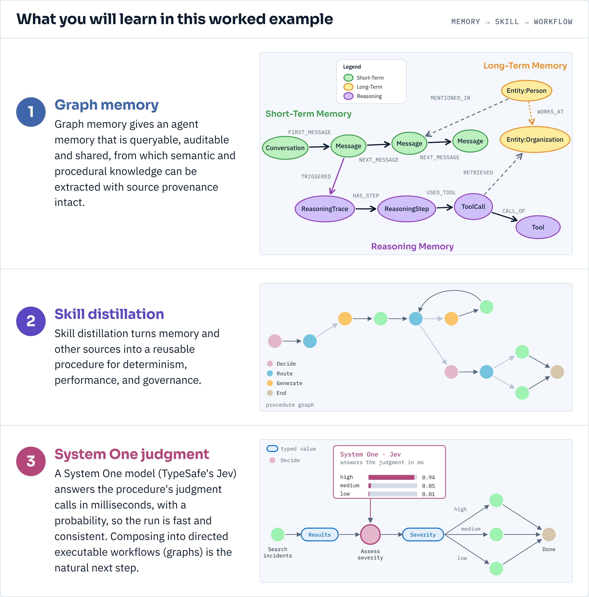
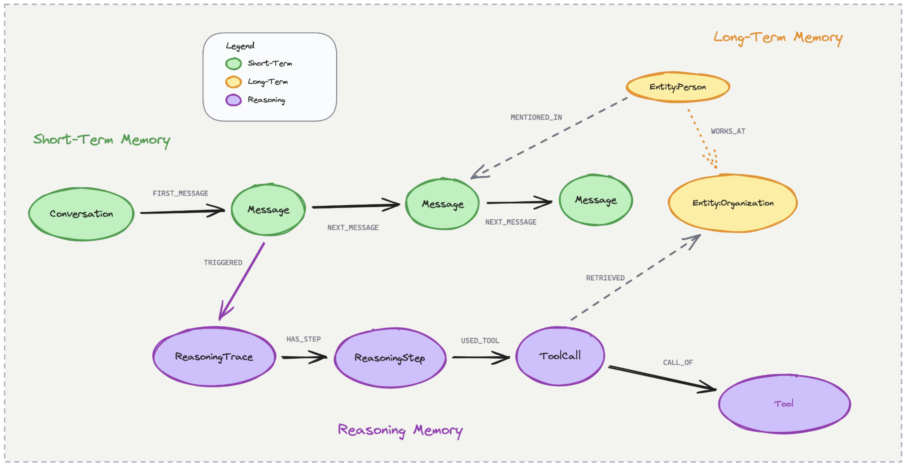
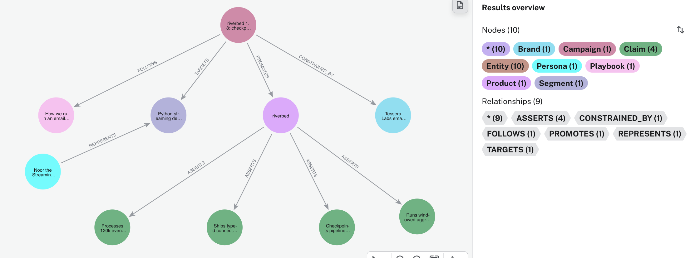
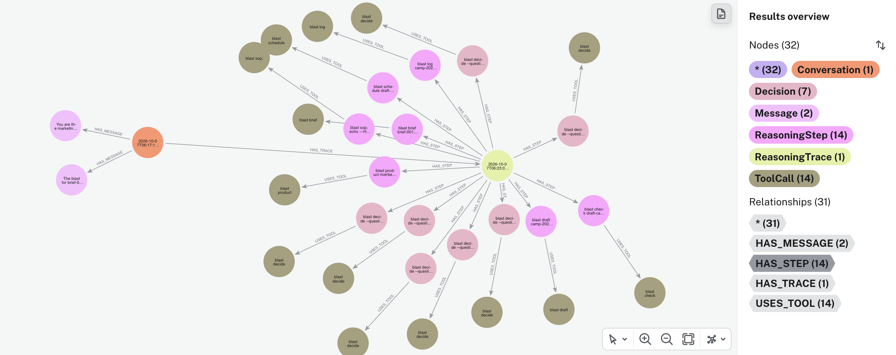
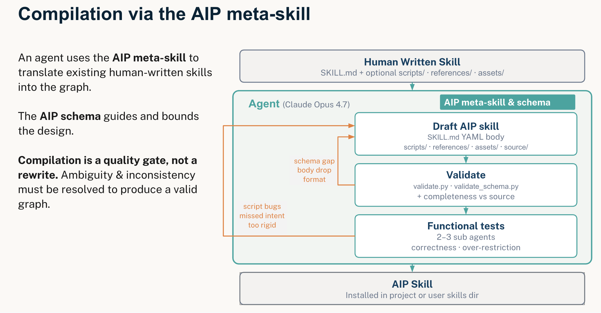
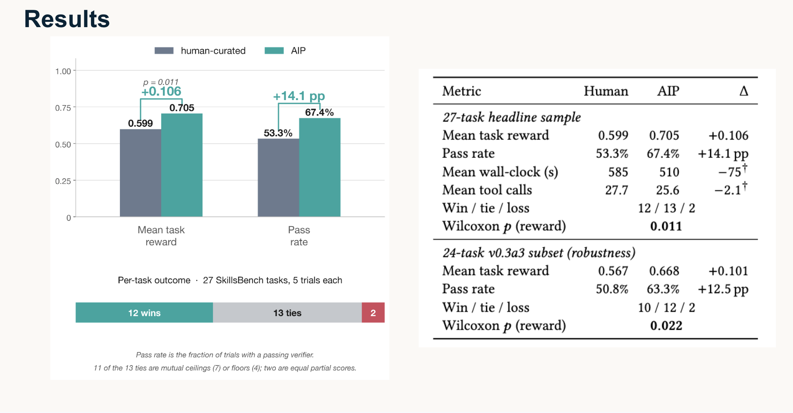
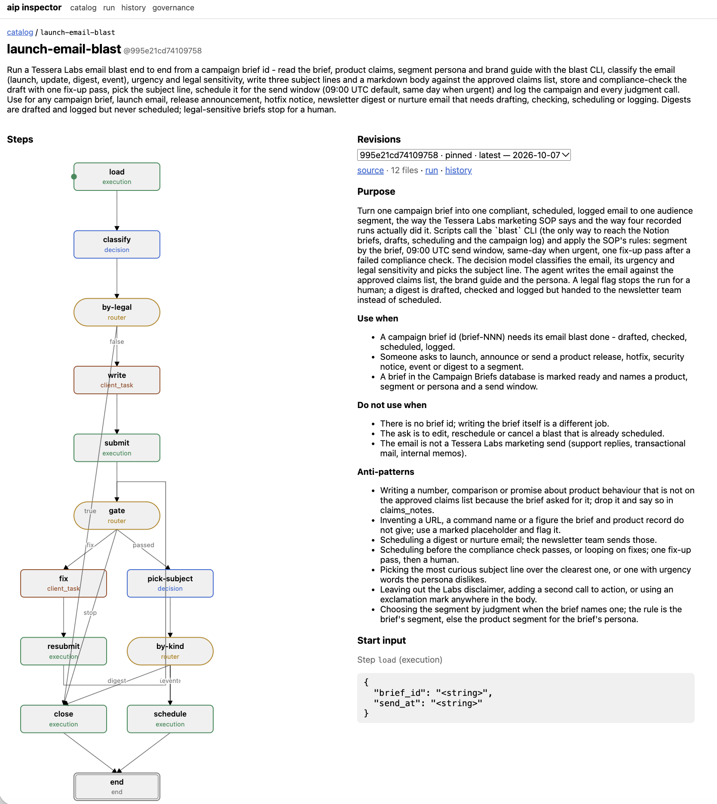
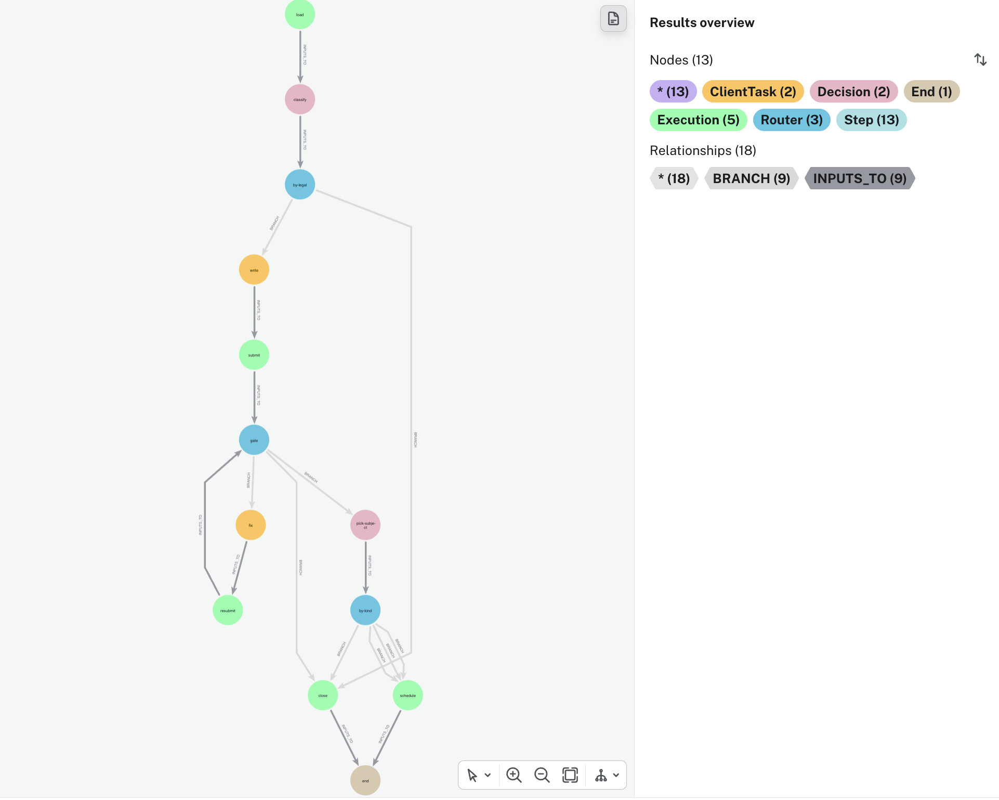
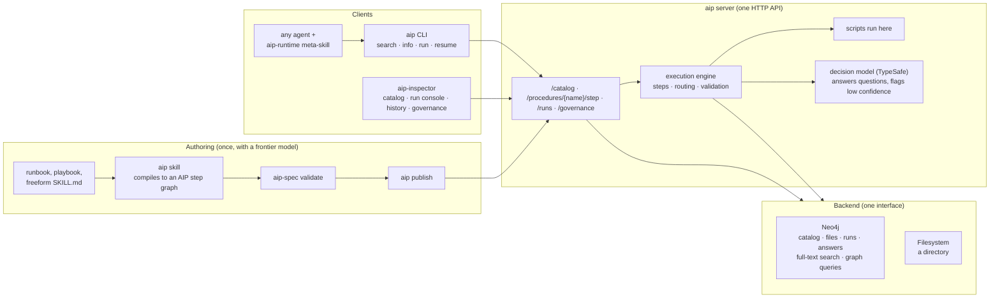

# AIP Skill Distillation Worked Example

`Distilling Agent Knowledge into System One Workflows with Graph Memory`

`<QR code linking to this doc here>`

We are going over three things in this example:

1. Graph memory for agents
2. Skill distillation and graph-shaped skills (AIP)
3. System One, structured decisions, and extending them naturally into a graph workflow




The example is an agent that runs email marketing campaigns from data kept in Notion. We will:

1. Review the use case
2. Put the Notion data into Neo4j agent memory
3. Record the agent creating some email blasts, as decision traces in memory. It is slow and a
   little inconsistent; that is the point
4. Distill the traces into a skill with AIP (NAMS can do this too; for structured decisions we
   use the new AIP version)
5. Run the skill and see what it does for consistency and speed

## Prerequisites

-  [uv](https://docs.astral.sh/uv/) and [Claude Code](https://claude.com/claude-code)
- Two Neo4j databases ([Aura](https://console.neo4j.io) Free is fine): one for agent memory, one
  for the aip server's catalog and run history
- `aip` and `aip-spec` installed, with the `aip` and `aip-runtime` skills in Claude Code:
  `curl -sSfL https://raw.githubusercontent.com/zach-blumenfeld/aip/aip-0.5a0/install.sh | bash`
  then `aip server --init` and fill in the Neo4j backend and the TypeSafe key, and
  `aip config --server http://localhost:8000` so the client and the agent find the server
- A [TypeSafe](https://typesafe.ai) API key (the aip server answers decisions with it; without it
  every decision pauses and asks you)
- In `aip-demo/`: `cp .env.example .env` (memory database credentials, TypeSafe key),
  `uv sync`, `uv tool install --editable .` so `blast` is on PATH, `uv run blast doctor`

## Use case and Notion data

Tessera Labs, a made-up open-source lab, keeps its marketing in Notion: four products and the
claims the team may make about each, six audience segments with their personas, a brand guide
(voice rules, banned claims, a required disclaimer, subject-line rules), thirteen campaign briefs,
and a page called "How we run an email blast" that new people are pointed at.

The job: take one brief and turn it into one compliant, scheduled, logged email to one segment.

A brief, as the team sees it in Notion (brief-001, the one the first recorded run worked from):

> ### riverbed 1.8: checkpointed state for every pipeline
>
> **Campaign ID** camp-2026-10-001 · **Product** riverbed · **Channel** Email · **Status** Ready
> **Segment** Python streaming developers · **Persona** Noor the Streaming Developer
> **Send window** 2026-10-14
>
> **Goal.** Announce the 1.8 release, whose headline is checkpointed pipeline state, and drive
> upgrades.
>
> **Key messages**
> 1. Pipeline state is checkpointed, so a restarted worker resumes where it stopped
> 2. One pip install, no changes to existing pipelines
> 3. New CLI command to inspect a checkpoint
>
> **CTA.** Upgrade with `pip install -U riverbed` and open the checkpoint quickstart.
>
> **Notes.** Keep it short, developers only. Link the quickstart and the changelog.

The pages it points at:

> **Python streaming developers** (Audience Segments) · 3,700 · developers who installed riverbed
> or starred the repo in the last 6 months · persona: Noor the Streaming Developer, who wants it
> direct, technical, show me the code, and is put off by marketing fluff and vague claims.

> **riverbed** (Products) · *Stream processing for Python that fits in one file* · approved
> claims: runs windowed aggregations over Kafka, Kinesis and local files with one API ·
> checkpoints pipeline state so a restarted worker resumes without reprocessing · ships typed
> connectors for Postgres, DuckDB and Parquet · processes 120k events per second per core on the
> published benchmark suite.


The data: `data/notion/*.json`, Notion-API-shaped, generated by `tools/make_fixture.py`. The SOP
page: `data/notion/sop_email_blast.md`. Read it; it is what the agent reads.

## Import Notion into Neo4j agent memory

First the data goes into [neo4j-agent-memory](https://neo4j.com/labs/agent-memory/), the
open-source graph memory library, so the agent can look things up easily and so
everything the agent later does lands in the same graph and connects to its sources.

Why graph memory: it gives the agent queryable, auditable and shared memory, from which semantic
and procedural knowledge can be extracted while keeping source provenance.



```
blast import          # SDK writes the entities, typed edges are added; then counts what landed
```

What the graph looks like: one campaign in the middle, the product it promotes and that product's
claims, the segment and its persona, the brand guide, the SOP page.

```cypher
MATCH (c:Campaign {brief_id: 'brief-001'})
MATCH p = (c)-[]->(n)
OPTIONAL MATCH q = (n)-[:ASSERTS|REPRESENTS]-(m)
RETURN p, q
```



How it is done, file by file, and how to do it with a real Notion workspace: [docs/import.md](docs/import.md).

## The agent uses memory and records email-blast traces

Claude Code gets a brief and one instruction: start by reading the team's page (`blast sop`). No
skill. It has a small `blast` command for the things an agent cannot do by hand
(read the brief, the product, the audiences, the brand guide; store a draft; run the compliance
check; schedule; log) and the SOP asks it to log every judgment call with `blast decide`.

Three Claude Code hooks write everything into the memory graph as it happens: the conversation,
and every `blast` call as a reasoning step with its tool call. Judgment calls get a `Decision`
label.

### How memory hooks up to Claude Code

The `neo4j-agent-memory` package is one client with three stores: `short_term` (conversations
and messages), `long_term` (entities, facts, relationships) and `reasoning` (traces, steps, tool
calls). It writes to a Neo4j you point it at. Setup ([`src/blast/memory.py`](src/blast/memory.py)):

```python
from neo4j_agent_memory import MemoryClient, MemorySettings

settings = MemorySettings(
    neo4j={"uri": NEO4J_URI, "username": NEO4J_USERNAME, "password": NEO4J_PASSWORD},
    extraction={"enable_spacy": False, "enable_gliner": False, "enable_llm_fallback": False},
)
async with MemoryClient(settings) as memory:
    ...
```

Extraction is off because the Notion import already gives us typed entities; left on, the package
would extract more entities from every message and tool result. Embeddings are off too (every
write passes `generate_embedding=False`), so no embedding provider is needed.

#### Writing to memory

Five methods do all the writing in this demo. Each one creates nodes in the graph:

| SDK call | creates |
|---|---|
| `memory.short_term.add_message(session_id, role, content)` | `(:Conversation {session_id})-[:HAS_MESSAGE]->(:Message {role, content})`; the conversation is created on first use |
| `memory.reasoning.start_trace(session_id, task)` | `(:ReasoningTrace {session_id, task})`; returns the trace with its `id` |
| `memory.reasoning.add_step(trace_id, thought=, action=, observation=)` | `(:ReasoningTrace)-[:HAS_STEP]->(:ReasoningStep {thought, action, observation, step_number})`; returns the step |
| `memory.reasoning.record_tool_call(step_id, tool_name, arguments, result=, status=)` | `(:ReasoningStep)-[:USES_TOOL]->(:ToolCall {tool_name, arguments, result, status})` |
| `memory.reasoning.complete_trace(trace_id, outcome=, success=)` | sets `completed_at`, `outcome`, `success` on the trace |

The Notion import used one more, `memory.long_term.add_entity(name, type, description=,
attributes=)`, which creates `(:Entity:<Type> {name, description, ...})`; the type becomes a
label, so `"Campaign"` gives `(:Entity:Campaign)`.

Who calls them: three Claude Code hooks in `.claude/settings.json`, which run `blast-hook` with
the event's JSON on stdin at each point in a session ([`src/blast/hooks.py`](src/blast/hooks.py)).
The Claude session id is used as the memory `session_id`, so one conversation and one trace per
session.

When you submit a prompt:

```python
trace = await memory.reasoning.start_trace(session_id, task=prompt[:200])
await memory.short_term.add_message(session_id, "user", prompt)
```

After every `blast` command Claude runs (the `PostToolUse` hook, matcher `Bash`; other commands
are ignored):

```python
step = await memory.reasoning.add_step(trace.id, thought="blast check",
                                       action="blast check draft-camp-2026-10-001-01",
                                       observation=json.dumps(result)[:500])
await memory.reasoning.record_tool_call(step.id, "blast check", {"args": args}, result=result,
                                        status=ToolCallStatus.SUCCESS)   # or FAILURE if the result carries an error
```

When the command was `blast decide`, the step is additionally labelled so judgment calls can be
queried on their own. The package has no field for this, so it is one Cypher statement with the
driver:

```python
cypher("MATCH (s:ReasoningStep {id: $id}) SET s:Decision, s.question = $q, s.options = $o, s.answer = $a, s.why = $w", ...)
```

When Claude finishes:

```python
await memory.short_term.add_message(session_id, "assistant", last_message)
await memory.reasoning.complete_trace(trace.id, outcome="completed", success=True)
```

#### Reading from memory

The package offers two kinds of read. The SDK methods: `memory.get_context(query, session_id=)`
assembles a text block from all three stores for a prompt; `memory.long_term.search_entities`,
`memory.short_term.search_messages` and `memory.reasoning.search_steps` are vector searches;
`memory.long_term.get_entity_by_name`, `memory.short_term.get_conversation`,
`memory.reasoning.get_trace_with_steps` and `list_traces` fetch by key. And since it is a Neo4j
database, plain Cypher.

This demo reads with Cypher, for two reasons: embeddings are off, so the vector searches are not
available, and the reads we need are exact lookups where a query says exactly what we mean.

The agent reading the team's page, `blast sop` ([`src/blast/tools.py`](src/blast/tools.py)):

```python
rows = cypher("MATCH (p:Playbook) RETURN p.name AS name, p.text AS text LIMIT 1")
```

Reading a run back out for the trace export and for distillation ([`src/blast/record.py`](src/blast/record.py)):

```python
cypher("""
  MATCH (t:ReasoningTrace {id: $id})-[:HAS_STEP]->(s:ReasoningStep)
  OPTIONAL MATCH (s)-[:USES_TOOL]->(c:ToolCall)
  RETURN s.thought, s.action, s:Decision AS is_decision, s.question, s.answer, s.why,
         c.tool_name, c.arguments, c.result, c.status
  ORDER BY s.step_number""", id=trace_id)
```

With embeddings on, the agent could instead call `memory.get_context("how do we run an email
blast", session_id=...)` and get the SOP, relevant entities and past steps in one string. That is
the package's intended read path; we kept the demo on exact queries to keep the graph legible.

**What is the package and what is ours.** The package writes every node. Three things are added
on top with the Neo4j driver, because the package's model does not say what we mean: the typed
domain edges on import (`PROMOTES`, `TARGETS`, ...; the package stores relationships as
`RELATED_TO` with the type in a property), the `Decision` label and fields on a judgment-call
step (the package has no notion of one), and the `HAS_TRACE` edge from a conversation to its
trace (the package keeps them as separate nodes sharing a `session_id`). All additive; nothing
the package created is changed. It is a Neo4j database, so when the model falls short you can
say what you mean.

Any `claude` session started in this folder is recorded; `BLAST_RECORD=0` switches it off. The
hooks never fail the session; problems go to `.run/recorder.log`. The hook plumbing itself and
how to do this for your own agent: [docs/recording.md](docs/recording.md).

To watch a run live (about five minutes; on stage, show the recording below instead):

```
claude
> New brief in Notion: brief-001, "riverbed 1.8: checkpointed state for every pipeline".
> Do the email blast for it: Python streaming developers, send window per the brief, 09:00 UTC.
```

The recording of the four runs we made:

```
blast traces show run-01      # also run-02 (launch), run-03 (digest), run-04 (urgent hotfix)
```

The same run in the memory graph, as a connected subgraph: the conversation and its two messages, the trace, every step
with its tool call. Judgment calls carry the extra `Decision` label; colour by label and they
stand out. Change `LIMIT 1` to `LIMIT 4` for all four runs side by side.

```cypher
MATCH (c:Conversation)-[ht:HAS_TRACE]->(t:ReasoningTrace)
WITH c, ht, t ORDER BY t.started_at LIMIT 1
MATCH p1 = (c)-[:HAS_MESSAGE]->(:Message)
MATCH p2 = (t)-[:HAS_STEP]->(:ReasoningStep)-[:USES_TOOL]->(:ToolCall)
RETURN c, ht, t, p1, p2
```


What to notice:

- **Wall time.** 5 to 8 minutes and 14 to 32 turns per run with the default model. Most of it is
  the model thinking between calls, not the tools.
- **Consistency.** All four runs did the same job, in four slightly different orders, with
  differently worded judgment calls, and one of them spent several turns deciding what to do
  about a missing URL. Every judgment is the language model's, every time.
- **The judgment calls themselves** are the valuable residue: what kind of email, how urgent,
  legal or not, which segment, which claims are allowed, which subject line. This query groups
  them across runs; these are the decision points of the procedure, found by doing the job:

```cypher
MATCH (d:Decision)
RETURN d.question AS question, collect(d.answer) AS answers, count(*) AS times
ORDER BY times DESC
```

How the tools and the hooks work, and how to set this up for your own agent: [docs/recording.md](docs/recording.md).

## Distilling memory into a skill

We distill the traces into a skill to fix the problems above. There are two major parts to this:

1. The skill we build is graph-shaped: a control flow with typed steps, decisions, script execution,
routers, and generative client tasks, instead of a page of prose.

2. The decision steps are answered by a System One model, which is where the speed and the
consistency come from.

We'll go over System One first, because it is a dependency of the flow.

### System One and structured decisions

A System One model answers a fixed question about an input and returns a typed value with a
calibrated probability, instead of generating text: pick one of these labels (choice), rate this
on a described scale (score), is this true (noul). TypeSafe's Jev is one; docs at
[docs.typesafe.ai](https://docs.typesafe.ai/), the concept at
[System One](https://docs.typesafe.ai/concepts/system-one).

This is a good fit for the steps in our traces that were judgment calls with a fixed answer space:
what kind of email is this (launch, update, digest, event), how urgent (normal, same day), does
legal need to see it (yes, no), which of the three subject lines (first, second, third). Fast,
cheap, and the probability tells you when to ask a human.

The natural next step is to take these small decisions and put them into a larger workflow, which
is what AIP does.

### AIP and skill distillation

We will use an experimental project [Agent Instruction Protocol (AIP)](https://github.com/zach-blumenfeld/aip/tree/aip-0.5a0) for the skill distillation process. 

[NAMS](https://memory.neo4jlabs.com/docs), the hosted Neo4j agent memory service, also distills
skills from memory ([From agent memory to portable skills](https://neo4j.com/blog/genai/from-agent-memory-to-portable-skills/)), but it does not incorporate structured decisions, so we use the Agent Instruction Protocol (AIP)
research project that NAMS's distillation was partly inspired by.

AIP is a representation for agent skills as graphs: an Agent Skill whose body is a
typed step graph (`decision`, `execution`, `client_task`, `router`, `end`) validated against a
schema. Paper: [AIP: A Graph Representation for Learning and Governing Agent Skills](https://arxiv.org/abs/2606.04781),
VLDB 2026 workshop. 

In the paper we showed that compiling skills to the AIP format resulted in improved task reward and pass rates across various diversified skills from the SkillsBench benchmark. 





We are on a later version than the paper (format 0.5a1) which includes:

1. a client-server runtime that executes the graph and enforces sequencing and typed
I/O
2. decision model steps with thresholds

### Skill distillation in this worked example
In this worked example we fed AIP the agent traces from the in memory graph to make the skill: [docs/compile.md](docs/compile.md). In short: the SOP
page plus the four traces read back out of memory (`blast traces export`), one prompt, and the
`aip` authoring skill, which chose a kind for every step, wrote the scripts and templates,
validated, and tested once. `skills/launch-email-blast/source/README.md` maps every step back to
the SOP or a trace.

### Loading the skill into the AIP server
Now we load it into the aip server (why, in the next section); for now it lets us inspect the
skill:

```
aip server --inspector                     # http://localhost:8000/inspector/
aip publish ./skills/launch-email-blast
```

You can view skills in the inspector. 



You can also query against the aip server's database to inspect. The whole skill: name, revision, procedure, steps, edges, inputs and questions:

```cypher
MATCH (n:Name {name: 'launch-email-blast'})-[:HAS_REVISION]->(s:Skill)-[:HAS_PROCEDURE]->(p:Procedure)
MATCH p1 = (p)-[:HAS_STEP]->(st:Step)
OPTIONAL MATCH p2 = (st)-[:INPUTS_TO|BRANCH]->(:Step)
OPTIONAL MATCH p3 = (st)-[:DECLARES_INPUT|ASKS]->()
RETURN n, s, p, p1, p2, p3
```

Just the steps and the flow between them (13 steps, 18 edges; labels are the step kinds):

```cypher
MATCH (:Name {name: 'launch-email-blast'})-[:HAS_REVISION]->(:Skill)-[:HAS_PROCEDURE]->(:Procedure)-[:HAS_STEP]->(st:Step)
OPTIONAL MATCH e = (st)-[:INPUTS_TO|BRANCH]->(:Step)
RETURN st, e
```



## Running graph skills, and what you get

We could take the skill folder and run it like any other Agent Skill: the agent reads `SKILL.md`
and walks the graph itself. But because it is a graph, the aip server can walk it instead, with a
programmatic interface for the agent that enforces the flow: the server validates inputs, runs the
scripts, sends each decision to Jev, follows the routers, and hands the agent only the pauses.
The runtime is described, with the architecture diagram, in the
[AIP README](https://github.com/zach-blumenfeld/aip/tree/aip-0.5a0#how-it-works).


Run it:

```
make fresh                        # from aip-demo/: forget earlier local runs and drafts
claude --model sonnet             # or plain claude
> Launch the email blast for brief-013, "riverbed 2.0 release", send 2026-11-04 09:00 UTC.
```

The agent's `aip-runtime` skill searches the catalog, inspects the match, starts the run, and
answers the one pause: writing the email. Everything else happens on the server.

What you get, measured on the same brief:

| | turns | wall | pauses for the agent |
|---|---|---|---|
| free-form agent from the SOP | 14 to 32 | 5 to 8 min | n/a, it did everything |
| skill through the server, default model | 20 | 100 to 120 s | 1 |
| skill through the server, Sonnet | 15 | 70 s | 1 or 2 |

Jev answered every decision above threshold (launch 1.0, normal urgency 0.98, no legal review
0.11); the agent never saw those questions. The order is now the graph: compliance before
scheduling, digests never scheduled, a legal flag stops the run. Every run is recorded as
`Run` → `StepRun` → `Answer` for governance.
Every run of the skill, with the answers the decision model gave:

```cypher
MATCH (r:Run {name: 'launch-email-blast'})-[:OF_SKILL]->(s:Skill)
MATCH p1 = (r)-[:STEP_RUN]->(sr:StepRun)
OPTIONAL MATCH p2 = (sr)-[:NEXT]->(:StepRun)
OPTIONAL MATCH p3 = (sr)-[:OF_STEP]->(:Step)
OPTIONAL MATCH p4 = (sr)-[:ANSWERED]->(:Answer)-[:OF_QUESTION]->(:Question)
RETURN r, s, p1, p2, p3, p4
```

## Additional resources

- neo4j-agent-memory: https://neo4j.com/labs/agent-memory/
- NAMS: https://memory.neo4jlabs.com/docs
- AIP: https://github.com/zach-blumenfeld/aip/tree/aip-0.5a0 ; spec: https://github.com/zach-blumenfeld/aip-spec ; paper: https://arxiv.org/abs/2606.04781
- Other Neo4j + AI resources: https://neo4j.com/developer/ai
- TypeSafe: https://docs.typesafe.ai/
